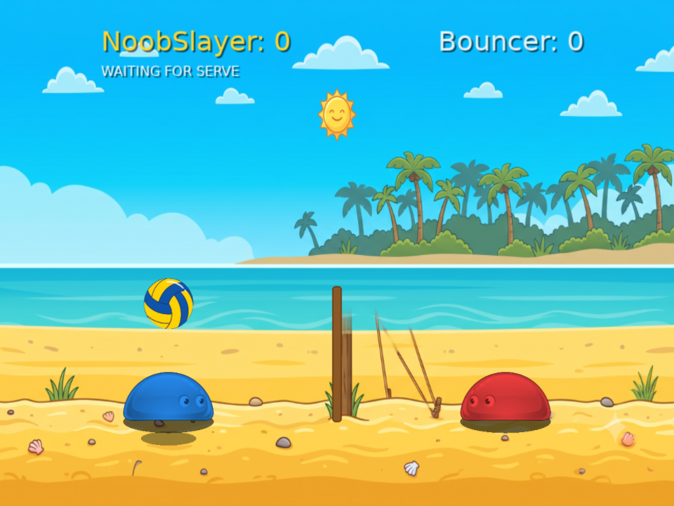

# Volley Dash

Zwei Blobs, ein Ball, ein Netz. Ein Arcade-Volleyball für LAN-Abende, gebaut in
[LÖVE 11.5](https://love2d.org) — gedacht für den Moment, in dem zwölf Leute an einem
Abend spielen wollen und niemand Lust auf eine Installationsanleitung hat.

---

## Herunterladen

**[→ Releases](../../releases)** — ZIP für Windows oder macOS.

**Windows:** ZIP erst **entpacken**, dann `VolleyDash.exe` doppelklicken. Beim ersten Start
meldet sich SmartScreen („Der Computer wurde durch Windows geschützt") — *Weitere
Informationen* → *Trotzdem ausführen*. Das Spiel ist nicht signiert; ein Zertifikat kostet
dreistellig im Jahr und lohnt für ein Feierabendprojekt nicht.

**macOS:** ZIP entpacken, dann **Rechtsklick auf die App → Öffnen** → im Dialog nochmals
*Öffnen*. Ein Doppelklick funktioniert beim ersten Mal nicht. Die App ist ad-hoc signiert,
aber nicht bei Apple notarisiert.

Beide Wege stehen ausführlich in der `LIESMICH.txt`, die jedem Paket beiliegt.

## Steuerung

| | Bewegen | Springen | Schmettern |
|---|---|---|---|
| **Spieler 1** | `A` / `D` | `W` | `S` |
| **Spieler 2** | `H` / `K` | `U` | `J` |
| **Gamepad** | Stick oder Steuerkreuz | `A` | `X` |

`ESC` öffnet das Menü und pausiert, `F11` schaltet Vollbild. Alle Tasten sind unter
*Settings → Controls* frei belegbar — bis auf die Pfeiltasten, die der Menüsteuerung
gehören.

Dash und Schmettern sind im voreingestellten Regelwerk `classic` **aus**, weil das Vorbild
sie nicht hatte. Wer sie will, stellt unter *Local Match → Ruleset* auf `prototype`.

## Im LAN spielen

**Noch nicht enthalten.** Der Menüpunkt *Network Match* trägt deshalb ein `[WIP]`.

Geplant ist LAN-Spiel **ohne IP-Eingabe**: Der Host öffnet eine Lobby, die anderen sehen
sie per UDP-Broadcast in der Serverliste und treten bei. Die manuelle IP-Eingabe bleibt als
gleichwertiger Weg daneben stehen, weil in fremden Netzen regelmäßig eine Firewall den
Broadcast schluckt. Unter Windows ist beim ersten Start die Freigabe für **private
Netzwerke** anzuhaken — wer diese Abfrage wegklickt, ist für den Rest des Abends
unsichtbar.

Die Architektur dahinter steht in [`docs/04_NETCODE_SPEC.md`](docs/04_NETCODE_SPEC.md).

## Turniermodus

**Noch nicht enthalten.** Geplant für 20 Teilnehmer mit Gruppenphase, K.-o.-Runde und
parallel laufenden Matches; der Turnierzustand wird als append-only Log geschrieben, damit
ein Absturz oder ein gezogener Stecker das Turnier nicht kostet. Entwurf in
[`docs/05_TOURNAMENT_SPEC.md`](docs/05_TOURNAMENT_SPEC.md).

## Warum es das gibt

Volley Dash ist eine **Neuimplementierung**, kein Fork. Es orientiert sich am Spielgefühl
von Blobby Volley (2000, Skoraszewsky/Mummert), enthält aber **keinen Code und keine Assets**
aus Blobby Volley oder dessen GPL-lizenzierter Fortsetzung Blobby Volley 2. Alle
Simulationswerte stammen aus dem eigenen Prototyp. Die Abgrenzung ist in
[`docs/references.md`](docs/references.md) im Einzelnen aufgeschrieben.

Der eigentliche Zweck ist nicht das Gameplay — das ist 25 Jahre alt und gratis zu haben.
Der Zweck ist, dass ein Dutzend Leute in 90 Sekunden ab Download spielen, ohne dass jemand
etwas erklären muss.

## Technical summary (English)

A LAN party volleyball game in LÖVE 11.5. The simulation runs at a fixed 1/60 s timestep on
a constant 800 × 600 logical field, is free of `love.*` and of randomness, and is driven
exclusively by `InputFrame` values — one per player per tick, produced by keyboard, gamepad,
bot, or network. Networking (from M2) will use host-authoritative snapshots over ENet with
UDP broadcast discovery; lockstep and rollback were considered and rejected. The tournament
system keeps its state in an append-only log written atomically.

The design documents under [`docs/`](docs/) are in German and are the actual substance of
this repository — in particular the netcode and tournament specs.

## Zum Stand des Projekts

Volley Dash entsteht nebenberuflich für konkrete LAN-Abende. Der Code ist frei nutzbar und
Pull Requests sind willkommen, aber **es gibt keine Zusage auf zeitnahe Bearbeitung von
Issues oder PRs**. Wenn du das Spiel für deine Zwecke brauchst: forke es.

Aktuell spielbar ist das lokale Match zu zweit an einer Tastatur oder gegen den Bot.
Was sonst noch fehlt, steht im [Changelog](CHANGELOG.md).

## Lizenz

[zlib](LICENSE) — freie Nutzung, auch kommerziell, solange die Herkunft nicht falsch
dargestellt wird.

- Fremdkomponenten in den Releasepaketen: [`LICENSE-THIRD-PARTY.md`](LICENSE-THIRD-PARTY.md)
- Herkunft jeder Grafik-, Klang- und Musikdatei: [`assets/CREDITS.md`](assets/CREDITS.md)
- Inspirationsquelle: Blobby Volley von Daniel Skoraszewsky und Silvio Mummert
